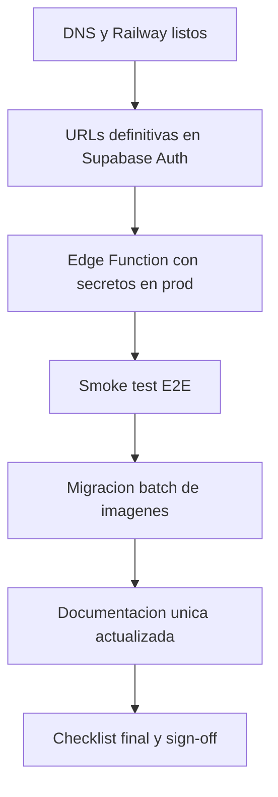

# Plan de go-live y cierre documental (mañana)

## Objetivo

Cerrar en un día los pendientes de salida a producción y dejar una única fuente de configuración operativa, incluyendo despliegue, DNS, túnel local de demo, migración de imágenes legacy y verificación final de flujos críticos.

## Alcance confirmado (estado actual)

- No hay objetivo activo en `[/Users/fcastrillo/src/work/cursor-config/00-personal-offtopic/distribuidorasis/current_objective.md](/Users/fcastrillo/src/work/cursor-config/00-personal-offtopic/distribuidorasis/current_objective.md)`.
- El backlog marca FEAT-1..4 como entregadas en `[/Users/fcastrillo/src/work/cursor-config/00-personal-offtopic/distribuidorasis/docs/BACKLOG.md](/Users/fcastrillo/src/work/cursor-config/00-personal-offtopic/distribuidorasis/docs/BACKLOG.md)`.
- Persisten checks abiertos de producción en `[/Users/fcastrillo/src/work/cursor-config/00-personal-offtopic/distribuidorasis/docs/SETUP.md](/Users/fcastrillo/src/work/cursor-config/00-personal-offtopic/distribuidorasis/docs/SETUP.md)`.
- Existen 46 imágenes legacy en `[/Users/fcastrillo/src/work/cursor-config/00-personal-offtopic/distribuidorasis/app/public/products](/Users/fcastrillo/src/work/cursor-config/00-personal-offtopic/distribuidorasis/app/public/products)` y no hay script batch de migración.

## Ruta de ejecución recomendada (orden crítico)

### Bloque 1 — Producción base (Railway + DNS + Auth)

- Definir dominio canónico final (`www` o raíz) y estrategia de redirects HTTPS.
- Conectar/verificar servicio en Railway para build Vite desde `[/Users/fcastrillo/src/work/cursor-config/00-personal-offtopic/distribuidorasis/app/package.json](/Users/fcastrillo/src/work/cursor-config/00-personal-offtopic/distribuidorasis/app/package.json)`.
- Configurar en Cloudflare los registros web (`A/CNAME`) hacia Railway para dominio final.
- Actualizar en Supabase Auth las URLs definitivas de `Site URL` y `Redirect URLs` (actualmente hay foco en localhost en `[/Users/fcastrillo/src/work/cursor-config/00-personal-offtopic/distribuidorasis/docs/SETUP.md](/Users/fcastrillo/src/work/cursor-config/00-personal-offtopic/distribuidorasis/docs/SETUP.md)`).

### Bloque 2 — Contacto productivo (Edge Function + correo)

- Desplegar/verificar `send-contact-email` en prod con secretos completos (`RESEND_API_KEY`, `CONTACT_EMAIL_TO`, `CONTACT_EMAIL_FROM`, `SUPABASE_SERVICE_ROLE_KEY`).
- Validar configuración pública esperada del endpoint (`verify_jwt=false`) y documentar explícitamente su racional de seguridad.
- Ejecutar smoke test real de envío (API responde con `id` + recepción en buzón de ventas).

### Bloque 3 — Datos y migraciones pendientes

- Aplicar migración `007_whatsapp_cta_attempts.sql` en proyecto Supabase de producción y validar RLS (`anon insert`, `admin select`).
- Ejecutar checklist de validación funcional en `/contacto`, CTA WhatsApp y dashboard `/admin/conversion`.

### Bloque 4 — Túnel local para demos/staging

- Crear/validar Cloudflare Tunnel para `staging.distribuidorasis.com.mx -> localhost:8080`, basado en la guía de `[/Users/fcastrillo/src/work/cursor-config/00-personal-offtopic/distribuidorasis/docs/SETUP_DOMAIN_CLOUDFLARE_RESEND.md](/Users/fcastrillo/src/work/cursor-config/00-personal-offtopic/distribuidorasis/docs/SETUP_DOMAIN_CLOUDFLARE_RESEND.md)`.
- Verificar que callbacks/redirects funcionen en subdominio real no productivo.

### Bloque 5 — Migración de imágenes legacy a Storage

- Diseñar script batch idempotente (dry-run + ejecución real) para cargar `app/public/products/*` al bucket `products`.
- Usar mapeo `product.slug -> filename` y persistir metadatos en `product_images` con `storage_path/public_url/sort_order/is_cover` cumpliendo constraints de `[/Users/fcastrillo/src/work/cursor-config/00-personal-offtopic/distribuidorasis/supabase/migrations/006_product_images_gallery_rules.sql](/Users/fcastrillo/src/work/cursor-config/00-personal-offtopic/distribuidorasis/supabase/migrations/006_product_images_gallery_rules.sql)`.
- Incluir rollback best-effort para objetos huérfanos si falla el insert en DB.

### Bloque 6 — Documentación única y limpieza de pendientes

- Consolidar todo en una única guía operativa principal (recomendado: mantener `[/Users/fcastrillo/src/work/cursor-config/00-personal-offtopic/distribuidorasis/docs/SETUP.md](/Users/fcastrillo/src/work/cursor-config/00-personal-offtopic/distribuidorasis/docs/SETUP.md)` como fuente maestra y convertir la guía de dominio en subsección o anexo referenciado).
- Actualizar estado inconsistente en `[/Users/fcastrillo/src/work/cursor-config/00-personal-offtopic/distribuidorasis/README.md](/Users/fcastrillo/src/work/cursor-config/00-personal-offtopic/distribuidorasis/README.md)` (hoy marca FEAT-3/4 como pendientes mientras backlog las tiene entregadas).
- Ajustar documentación sobre rate-limit: dejar explícito que no hay rate-limit aplicativo implementado en la edge function y que el control actual depende de proveedor/plataforma; documentar mitigaciones operativas (WAF, captcha, monitoreo).

## “Algo más” recomendado para no dejar deuda crítica

- Endurecimiento mínimo del endpoint público de contacto: política CORS por dominio permitido y control anti-abuso (captcha o challenge + límites per-IP en edge/proxy).
- Runbook de rollback y operación: pasos para revertir deploy, verificar salud y rotar secretos.
- Verificación post-go-live de observabilidad: revisar logs de Railway/Supabase Function y tasa de error del flujo de contacto durante primeras 24h.

## Secuencia visual (dependencias)

## Criterio de cierre (Definition of Done de mañana)

- Dominio productivo resuelve y sirve app en Railway con HTTPS.
- Auth OTP y redirects funcionan en dominio final.
- `send-contact-email` opera en prod y entrega correos reales.
- Migración `007` aplicada y dashboard de conversión funcional.
- Túnel staging operativo para demos/QA local.
- Imágenes legacy migradas a Storage con script repetible/idempotente.
- Una sola guía de configuración actualizada y sin contradicciones de estado.

