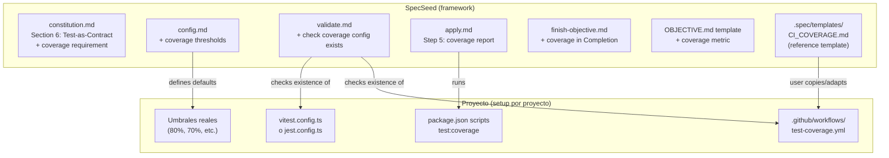

# Integración de Cobertura de Tests en SpecSeed

## Análisis: Separación de Responsabilidades

La clave es que SpecSeed es un **framework de proceso** agnóstico al stack. No genera `vitest.config.ts` ni `package.json`, sino que **exige, documenta y valida** que la cobertura exista.




---

## Cambios en SpecSeed (el framework)

### 1. `.spec/constitution.md` -- Section 6: Test-as-Contract

Ampliar la seccion actual para incluir cobertura como parte del contrato:

```markdown
## 6. TEST-AS-CONTRACT MECHANISM

... (contenido existente) ...

### Coverage as Quality Gate

- **Minimum Coverage:** Every project must configure a coverage threshold in `.spec/config.md`.
- **Local Execution:** `@apply` must report coverage after completing all tasks.
- **CI Enforcement:** Projects with CI must fail the pipeline if coverage drops below the threshold.
- **Coverage Command:** The project's `package.json` must include a `test:coverage` script.
```

Referencia actual: `[.spec/constitution.md](.spec/constitution.md)` lineas 126-137.

### 2. `.spec/config.md` -- Nueva seccion Coverage

Agregar una seccion configurable con defaults:

```markdown
## Coverage

| Setting | Value | Options |
|:--------|:------|:--------|
| **enabled** | `true` | `true` / `false` |
| **tool** | `vitest` | `vitest` / `jest` / `other` |
| **thresholds.lines** | `80` | 0-100 |
| **thresholds.functions** | `80` | 0-100 |
| **thresholds.branches** | `80` | 0-100 |
| **thresholds.statements** | `80` | 0-100 |
| **ci_workflow** | `true` | `true` / `false` |
```

Referencia actual: `[.spec/config.md](.spec/config.md)`.

### 3. `.spec/commands/apply.md` -- Nuevo Step 5: Coverage Report

Despues del Step 4 (Manual Testing) y antes del Step 5 actual (Summary), insertar:

```markdown
### Step 5: Coverage Check

If coverage is enabled in `.spec/config.md`:

1. Run the project's coverage command (e.g. `npm run test:coverage`).
2. Capture the coverage percentages (lines, functions, branches, statements).
3. Compare against thresholds from `.spec/config.md`.
4. If any metric is below threshold, **WARN** the user (do not block — the CI will enforce).
5. Record the coverage snapshot for `@finish-objective`.
```

El Summary actual pasa a ser Step 6 y se le agrega la linea de cobertura:

```
=== APPLY COMPLETE ===
Objective: HU-N.M — [Title]
Tasks completed: N/N
Tests passing: [count]
Coverage: [lines]% lines, [functions]% functions, [branches]% branches
Files modified: [list]
```

Referencia actual: `[.spec/commands/apply.md](.spec/commands/apply.md)` lineas 92-105.

### 4. `.spec/commands/finish-objective.md` -- Coverage en Completion

En el Step 3 (Archive), agregar coverage al bloque de Completion:

```markdown
- **Coverage:** [lines]% lines, [functions]% functions, [branches]% branches, [statements]% statements
```

Referencia actual: `[.spec/commands/finish-objective.md](.spec/commands/finish-objective.md)` lineas 82-99.

### 5. `.spec/templates/OBJECTIVE.md` -- Coverage en Completion section

Agregar el campo de coverage en la seccion Completion del template:

```markdown
## Completion

- **Date:** [filled at close]
...existing fields...
- **Coverage:** [lines]% lines | [functions]% functions | [branches]% branches | [statements]% statements
```

Referencia actual: `[.spec/templates/OBJECTIVE.md](.spec/templates/OBJECTIVE.md)` lineas 75-83.

### 6. `.spec/commands/validate.md` -- Checks de Coverage

Agregar una nueva seccion en Validation Checklists:

```markdown
### Coverage Configuration (if coverage enabled in config.md)

- [ ] `package.json`: Contains `test:coverage` script.
- [ ] Coverage tool config file exists (vitest.config.ts, jest.config.ts, or equivalent).
- [ ] Thresholds are defined in the tool config or in `.spec/config.md`.
- [ ] CI workflow exists at `.github/workflows/` with a test-coverage job (if ci_workflow=true).
```

Y una nueva regla automatica en la tabla:

```markdown
| **Coverage** | `test:coverage` in package.json | **WARNING** | No coverage script configured. | Add `test:coverage` script to package.json. |
```

Nota: Es WARNING, no BLOCKER, porque un proyecto podria estar en fase temprana sin tests aun.

Referencia actual: `[.spec/commands/validate.md](.spec/commands/validate.md)` lineas 38-83.

### 7. `.spec/templates/CI_COVERAGE.md` -- Template de referencia para GitHub Actions

Crear un nuevo template de referencia (no un `.yml` directo, sino un `.md` con el YAML embebido y explicaciones). Esto respeta la filosofia de SpecSeed de ser un framework de specs, no de scaffolding de codigo:

```markdown
# CI Coverage Template

> Reference template for setting up test coverage in GitHub Actions.
> Copy and adapt the workflow below to your project's `.github/workflows/test-coverage.yml`.

## Vitest Variant

(yaml block with the workflow for Vitest)

## Jest Variant

(yaml block with the workflow for Jest)

## Optional: Codecov Integration

(brief instructions for adding Codecov reporting)
```

### 8. `scripts/init.sh` y `scripts/adopt.sh` -- Mención en Next Steps

Agregar una linea en los "Next steps" de ambos scripts:

```
echo "  5. Configure test coverage: see .spec/templates/CI_COVERAGE.md"
```

No se copia automaticamente el workflow a `.github/` porque:

- El proyecto puede no tener `package.json` todavia
- El stack puede no ser Node.js
- La decision de CI es del proyecto, no del framework

### 9. `.spec/ROADMAP.md` -- Documentar la mejora

Agregar la version 0.4.0 con esta mejora en el Version History.

---

## Lo que queda en cada proyecto (NO en SpecSeed)

Estas son acciones que el usuario (o la IA durante `@spec-init` / `@apply`) ejecuta en el proyecto destino:

1. `**package.json**` -- Agregar script `test:coverage`
2. `**vitest.config.ts` / `jest.config.ts**` -- Configurar reporter y thresholds
3. `**.github/workflows/test-coverage.yml**` -- Copiar y adaptar desde el template
4. **Umbrales especificos** -- Decidir si 80% o mas/menos segun madurez del proyecto

El flujo natural seria:

- `@spec-init` detecta que el stack incluye testing y sugiere configurar cobertura
- `@validate` avisa si falta la configuracion
- `@apply` ejecuta y reporta
- `@finish-objective` archiva los datos

---

## Resumen de archivos a modificar/crear


| Archivo                              | Accion                      | Impacto                                   |
| ------------------------------------ | --------------------------- | ----------------------------------------- |
| `.spec/constitution.md`              | Editar seccion 6            | Bajo -- 4 lineas nuevas                   |
| `.spec/config.md`                    | Agregar seccion Coverage    | Bajo -- tabla nueva                       |
| `.spec/commands/apply.md`            | Insertar Step 5             | Medio -- nuevo paso + summary actualizado |
| `.spec/commands/finish-objective.md` | Agregar campo coverage      | Bajo -- 1 linea en template               |
| `.spec/commands/validate.md`         | Agregar checklist + regla   | Medio -- nueva seccion + 1 fila en tabla  |
| `.spec/templates/OBJECTIVE.md`       | Agregar campo coverage      | Bajo -- 1 linea                           |
| `.spec/templates/CI_COVERAGE.md`     | **Crear**                   | Medio -- template de referencia nuevo     |
| `scripts/init.sh`                    | Agregar linea en next steps | Bajo -- 1 echo                            |
| `scripts/adopt.sh`                   | Agregar linea en next steps | Bajo -- 1 echo                            |
| `.spec/ROADMAP.md`                   | Agregar version 0.4.0       | Bajo -- entrada nueva                     |
| `.spec/VERSION`                      | Bump a 0.4.0                | Bajo                                      |


